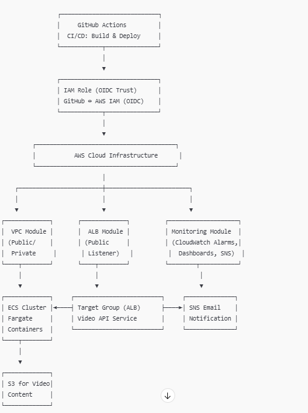

# Principal DevOps Engineer Technical Assessment – StreamAMG

## Overview

This repository contains my response to the StreamAMG Principal DevOps Engineer Technical Assessment. The focus is on designing scalable, reliable infrastructure for a video streaming platform using AWS, Infrastructure as Code, and DevOps best practices.

This submission demonstrates a scalable, secure, and modular cloud infrastructure design tailored for StreamAMG's video streaming platform. The goal was to address live event traffic spikes, observability, automation, and modular infrastructure.

---

## Architecture Summary

### Key Components

* **API Service**: Deployed via ECS Fargate behind an ALB
* **Content Delivery**: Utilizes Amazon CloudFront with S3 origin for scalable video delivery
* **Event-Driven Workflows**: Handled via Amazon SQS and Lambda for encoding completion and metadata processing
* **Monitoring**: AWS CloudWatch Dashboards and Alarms for:

  * Latency and error rates (API/Streaming)
  * CDN cache hit ratio
  * Encoding job statuses

### Diagram

Refer to `architecture.md` or open `streamamg_architecture.png`
 

---

## Infrastructure-as-Code

* Written in **Terraform**, using a **modular structure** under `/modules`
* Key Modules:

  * `api_service` (ECS Cluster, Task Definitions, ALB)
  * `cdn` (CloudFront Distribution, S3 Bucket)
  * `event_processor` (SQS Queue + Lambda Skeleton)

## Structure

- `modules/` – Reusable Terraform modules (VPC, ECS, ALB, etc.)
- `main.tf` – Root configuration
- `variables.tf` – Input variables
- `outputs.tf` – Outputs for other modules or environments
---

## CI/CD Pipeline

Using **GitHub Actions**:

* Validates and formats Terraform code
* Plans and applies changes to `dev` environment
* File: `.github/workflows/terraform.yml`

---

## Monitoring Strategy

* **CloudWatch Alarms**:

  * `5XX` errors on ALB and API Gateway
  * SQS Dead Letter Queue (DLQ) size
  * Lambda duration and error count
* **CloudWatch Dashboards** to monitor stream latency and cache efficiency
* Optional: use **Amazon Managed Grafana** for better visualizations

---

## Security Considerations

* IAM roles are scoped to least privilege
* HTTPS enforced across all endpoints (CloudFront and ALB)
* Secrets managed via AWS Secrets Manager (not implemented in this sample)
* S3 buckets are private by default with signed URLs or OAI

---

## AI Usage Documentation

**Tools Used:**

* ChatGPT (OpenAI): Used to generate infrastructure code, CI pipeline, and architectural documentation.
* GitHub Copilot: Autocompleted Terraform stubs within VS Code

**Verification Steps:**

* Manually validated Terraform with `terraform plan`
* Compared AI-generated code with AWS documentation and personal AWS experience
* Simplified output to fit within the 2-hour window

**Manual Expertise Applied:**

* Adjusted module inputs/outputs to reflect real-world use cases
* Decided on Fargate over EC2 for simplicity
* Used ALB instead of API Gateway due to ECS context
* Simplified CloudFront setup while maintaining scalability

---

## What I'd Do Next (Given More Time)

* Implement Terraform state management using S3 + DynamoDB backend
* Add WAF to CloudFront for DDoS protection
* Include automated video encoding jobs (via MediaConvert or Elemental)
* Implement parameterized environments (staging, prod)
* Add Prometheus/Grafana-based monitoring pipeline

---

## Setup Instructions

```bash
cd amg-assessment-project
terraform init
terraform plan
terraform apply
```

Note: Some modules and resources are stubs or mocks to illustrate architectural intent.
